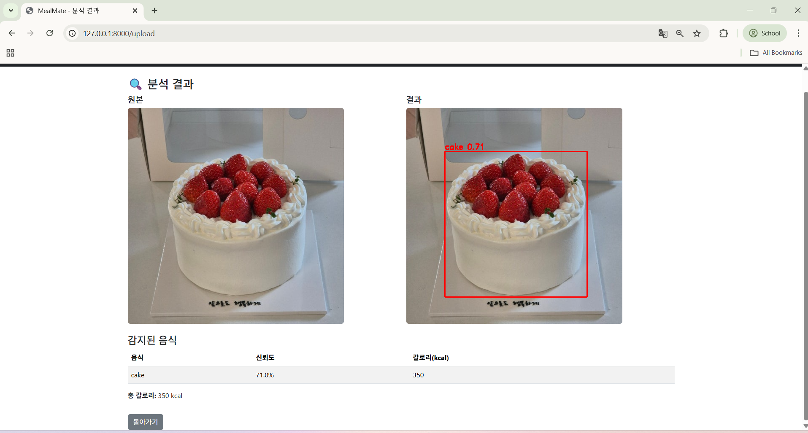
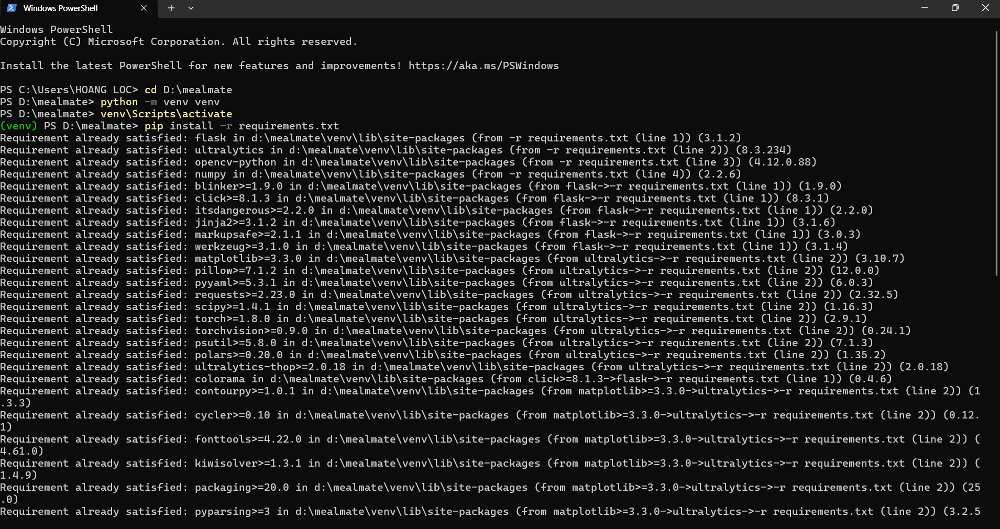
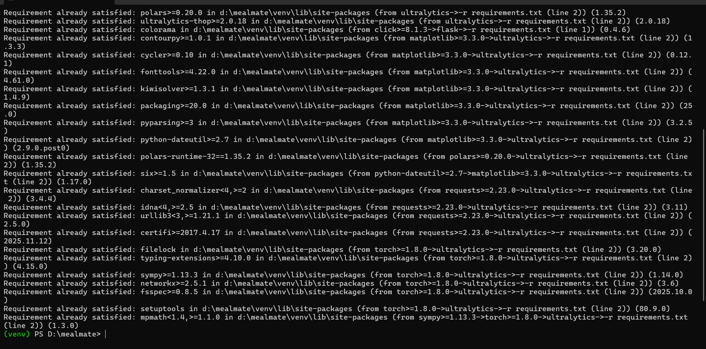
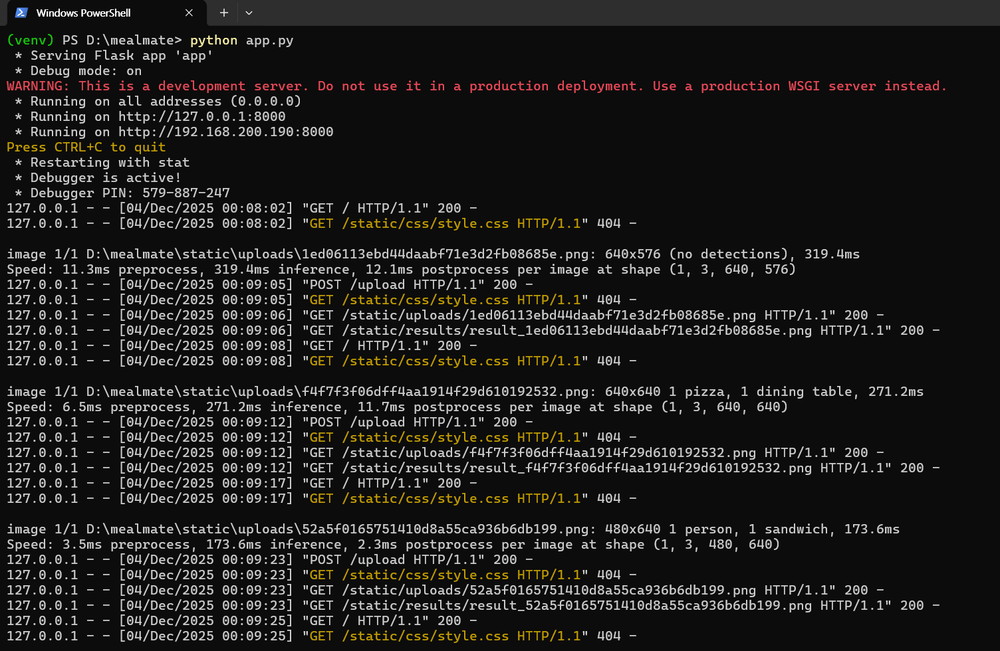

# 🍽️ MealMate – 음식 이미지 분석 및 칼로리 추정 웹 서비스

MealMate는 사용자가 업로드한 음식 사진을 기반으로  
**YOLOv8 객체 탐지 모델을 활용하여 음식 종류를 분석하고**,  
**해당 음식의 예상 칼로리를 계산해주는 웹 서비스**입니다.

본 프로젝트는 서울과학기술대학교 오픈소스소프트웨어 수업의 Term Project로 개발되었습니다.

---

## 🚀 기능 소개

### ✔ 1. 음식 이미지 업로드  
사용자는 자신의 디바이스에서 음식 사진을 선택하여 업로드할 수 있습니다.

### ✔ 2. YOLOv8 기반 음식 감지  
Ultralytics YOLOv8 모델(yolov8s.pt)을 사용하여  
이미지 속 객체를 분석합니다.

### ✔ 3. 음식만 필터링  
COCO Dataset에는 음식이 아닌 객체(사람, 휴대폰 등)가 포함되어 있으므로  
내부적으로 정의한 **FOOD_CLASSES** 를 통해 음식만 선별합니다.

### ✔ 4. 칼로리 계산  
사전에 설정된 칼로리 테이블(CALORIE_TABLE)을 기반으로  
감지된 음식들의 추정 칼로리를 계산합니다.

### ✔ 5. 감지 실패 시 안내 메시지 표시  
음식이 감지되지 않으면 사용자에게 친절한 안내 문구가 출력됩니다.

---

## 🖥️ 실행 화면 예시

### ▶ 메인 화면


### ▶ 분석 결과 화면


---

## 🛠️ 사용 기술

- **Python 3.10+**
- **Flask (백엔드)**
- **Ultralytics YOLOv8s (AI 모델)**
- **OpenCV (이미지 처리)**
- **HTML / CSS / Bootstrap (프론트엔드)**

---

## 📦 설치 및 실행 방법

### 1) 가상환경 생성 및 활성화

```bash
python -m venv venv
venv\Scripts\activate   # Windows
```

### 2) 패키지 설치

```bash
pip install -r requirements.txt
```

### 3) 서버 실행

```bash
python app.py
```

브라우저에서 아래 주소로 접속:

```
http://127.0.0.1:8000
```

---

## 📁 프로젝트 구조

```
mealmate/
│-- app.py
│-- requirements.txt
│-- LICENSE
│-- README.md
│
├── static/
│   ├── uploads/    # 업로드된 원본 이미지
│   ├── results/    # YOLO 분석 결과 이미지
│   └── css/
│       └── style.css
│
├── templates/
│   ├── base.html
│   ├── index.html
│   └── result.html
│
└── venv/ (업로드 제외 가능)
```

---

## 🔍 칼로리 테이블 예시

```python
CALORIE_TABLE = {
    "pizza": 285,
    "burger": 295,
    "sandwich": 250,
    "hot dog": 290,
    "cake": 350,
    "donut": 250,
    "banana": 96,
    "apple": 52,
    "orange": 47,
    "egg": 78
}
```

---

## 📜 라이선스

본 프로젝트는 MIT License를 따릅니다.  
자세한 내용은 `LICENSE` 파일을 참고하세요.

---

## 👨‍💻 개발자

**TRAN HOANG LOC (전황록)**  
SeoulTech – Computer Science  
Open Source Software Term Project


